# Cacio e Pepe

## Software (Ingredients)

- 110g finely grated Pecorino Romano cheese  
- 50g finely grated Parmesan cheese  
- 70g extra-virgin olive oil  
- 14g freshly ground black pepper (plus more for serving, if desired)  
- 454g dry spaghetti  
- 20g kosher salt  
- Cold water (for cooking the pasta)  

---

## Hardware (Equipment)

- Large, deep mixing bowl  
- 3-quart straight-sided sauté pan (or similar)  
- Wooden spoon  
- Tongs  
- Ladle  
- Measuring cup  

---

## Procedure

### 1. Prepare the Cheese Paste:
1. In a large, deep mixing bowl, combine:  
   - 2 3/4 cups (100g) Pecorino Romano cheese  
   - All of the Parmesan cheese  
   - Olive oil  
   - Black pepper (14g)  
2. Work the ingredients together with the back of a wooden spoon until a thick paste forms (about 2-3 minutes).  
3. Set aside while cooking the pasta.  

### 2. Cook the Pasta:
1. Combine the pasta and kosher salt in a 3-quart straight-sided sauté pan.  
2. Add enough cold water to just barely cover the pasta (about 1 1/2 inches deep).  
3. Cover the pan and place it over medium-high heat to bring the water to a boil (about 10 minutes).  
4. Once the water boils, remove the lid and decrease the heat to medium to maintain a simmer.  
5. Stir the pasta every minute to ensure the ends stay submerged and the noodles don't stick together.  

### 3. Prepare the Sauce Base:
1. After the pasta has been simmering for 5 minutes, ladle out 1 cup of the cooking water into a measuring cup.  
2. Slowly drizzle 3/4 cup of the reserved pasta water into the cheese paste while stirring to create a smooth sauce base (about 2 minutes).  

### 4. Finish Cooking the Pasta:
1. Check the pasta for doneness; it should be just barely al dente.  
2. If it's not ready, continue checking every 30 seconds until satisfied.  

### 5. Combine Pasta with Sauce:
1. Use tongs to lift the pasta out of the cooking water and allow it to drain briefly before adding it to the bowl with the cheese paste.  
2. Toss and stir the pasta vigorously for 2 minutes.  
   - The pasta will continue to release starch, and the sauce will emulsify.  
   - If the sauce clumps, add a small amount of reserved pasta water and continue tossing.  
3. After about 1 1/2 minutes, the sauce will transform into a creamy emulsion.  

### 6. Plate and Serve:
1. Portion the pasta into four bowls.  
2. Top with the remaining Pecorino Romano and additional freshly ground black pepper (if desired).  
3. Serve immediately.  

---

## Notes

- **Cheese Substitutions**: While Pecorino Romano is ideal for its sharpness, you can use all Parmesan if necessary. However, the flavor will be milder.  
- **Pepper**: Freshly ground black pepper gives the best aroma and spice. Adjust the amount to taste.  
- **Pasta Shape**: While spaghetti is traditional, bucatini or linguine also work well in this recipe.  
- **Water Depth**: Using less water than usual for cooking pasta ensures a more starchy liquid, crucial for emulsifying the sauce.  

---

## Timing Diagram

```mermaid
gantt
    title Cacio e Pepe Timing Diagram
    dateFormat  HH:mm
    axisFormat  %H:%M

    section Prepare Cheese Paste
    Combine cheese, oil, and pepper              :done,   t1, 00:00, 00:03

    section Boil Pasta Water
    Heat water to boil                           :active, t2, 00:03, 00:13

    section Cook Pasta
    Boil pasta until just shy of al dente        :active, t3, 00:13, 00:23

    section Prepare Sauce Base
    Reserve pasta water and mix with cheese paste:active, t4, 00:20, 00:23

    section Combine Pasta and Sauce
    Toss pasta with cheese paste                 :active, t5, 00:23, 00:26
    Emulsify sauce                               :active, t6, 00:26, 00:28

    section Plate and Serve
    Portion, garnish, and serve                  :done,   t7, 00:28, 00:30
```

