# Harissa Recipe

## Ingredients

### Spices:
- Cumin Seeds: **2 tablespoons**
- Coriander Seeds: **1 tablespoon**
- Caraway Seeds: **1 teaspoon**

### Other Ingredients:
- Olive Oil: **1/4 cup**
- Garlic Cloves: **8 large**, thinly sliced
- Onion: **1 medium**, diced
- Kosher Salt: **1 tablespoon**
- Tomato Paste: **3 tablespoons**
- Urfa Biber (or Aleppo Pepper): **1 cup**
- Red Wine Vinegar: **1/4 cup**

---

## Equipment
- **Cast Iron Skillet**
- **Food Processor**

---

## Instructions

### 1. Toast the Spices
- Heat a **cast iron skillet** over medium heat. 
- Add the cumin, coriander, and caraway seeds. Toast until fragrant, about **3–5 minutes**. Stir occasionally to avoid burning.

### 2. Sauté Aromatics
- Add **olive oil** to the skillet. Stir in the thinly sliced **garlic**, **onion**, and **salt**.
- Cook until the garlic begins to brown, about **2–3 minutes**. The salt will help draw out flavors and slow down the browning of the onions.

### 3. Add Tomato Paste and Peppers
- Stir in the **tomato paste** thoroughly. 
- Add the **Urfa Biber** (or **Aleppo Pepper**) and mix well. Cook for **1 minute**.

### 4. Add Vinegar
- Pour in the **red wine vinegar** and stir to combine.
- Cook for **2 more minutes**, or until the pungent vinegar smell cooks off.

### 5. Blend to Finish
- Transfer the mixture to a **food processor**. Blend until smooth, scraping down the sides as needed.
- Store the harissa in a glass container (avoid plastic) and refrigerate.

---

## Notes
- **Storage**: Harissa can be stored in the refrigerator for up to **2 weeks**. For longer storage, top it with a thin layer of olive oil to preserve freshness.
- **Substitution**: If Urfa Biber or Aleppo Pepper is unavailable, substitute with a mix of red chili flakes and sweet paprika (adjust to taste).

---

## Timing Diagram

```mermaid
gantt
title Harissa Preparation Timing

dateFormat  HH:mm
axisFormat  %H:%M
section Toast Spices
Toast cumin, coriander, and caraway seeds       :done,    t1, 00:00, 00:05
section Sauté Aromatics
Cook garlic, onion, and salt in olive oil       :active,  t2, 00:03, 00:08
section Add Tomato Paste and Peppers
Mix tomato paste and Urfa Biber                 :active,  t3, 00:07, 00:09
section Add Vinegar
Stir in red wine vinegar                        :done,    t4, 00:09, 00:11
section Blend and Store
Blend in food processor and refrigerate         :done,    t5, 00:11, 00:13
```

