# Lemon Cream Sauce Recipe

## Ingredients

- **1 quart cream**
- **Zest of 4 lemons**
- **15g garlic**
- **10g shallot**
- **20g butter**
- **250g white wine**
- **125g white wine vinegar**
- **5g salt**

## Equipment

- **Saucepan**: For simmering the sauce ingredients.
- **Knife & Cutting Board**: For chopping garlic and shallots.
- **Zester or Grater**: For zesting the lemons.
- **Wooden Spoon**: For stirring the sauce.
- **Measuring Cups & Spoons**: For accurate measurements of wine, vinegar, and salt.
- **Strainer**: For straining the sauce if desired.

## Procedure

### 1. Prepare the Aromatics
- Finely chop the **garlic** and **shallot**.
- Zest the **4 lemons** and set aside.

### 2. Cook the Aromatics
- In a saucepan, melt **20g butter** over medium heat.
- Add the chopped garlic and shallots, sautéing until soft and fragrant, about **3-4 minutes**.

### 3. Deglaze the Pan
- Add **250g white wine** and **125g white wine vinegar** to the pan. 
- Stir well to combine, scraping any bits off the bottom of the pan.
- Bring the mixture to a simmer and let it cook until it reduces by about half, about **5-7 minutes**.

### 4. Add Cream and Lemon Zest
- Once the wine mixture has reduced, add the **1 quart cream** to the pan.
- Stir in the **zest of 4 lemons** and **5g salt**.
- Bring the sauce to a simmer again, stirring occasionally. Let it cook for about **5-7 minutes** or until the sauce has thickened to your desired consistency.

### 5. Adjust and Finish
- Taste the sauce and adjust seasoning, adding more salt if necessary.
- If a smoother texture is desired, strain the sauce through a fine mesh strainer to remove the garlic, shallots, and zest.

### 6. Serve
- Remove from heat and serve immediately over pasta, seafood, or chicken.

## Suggestions

- **Wine**: Use a dry white wine like Sauvignon Blanc or Chardonnay for the best results.
- **Cream**: For a lighter version, you can substitute half of the cream with milk, but the texture will be thinner.
- **Lemon Zest**: If you prefer a more intense lemon flavor, you can add an additional lemon zest or a squeeze of fresh lemon juice at the end.
- **Straining**: Straining the sauce removes the shallots and garlic, giving it a smooth, refined texture, but you can leave them in if you prefer a chunkier sauce.

## Timing Diagram (Mermaid Gantt)

```mermaid
gantt
    title Lemon Cream Sauce Recipe Timing Diagram
    dateFormat  HH:mm
    section Aromatic Preparation
    Chop Garlic & Shallots:            00:00, 00:05
    Zest Lemons:                       00:05, 00:10

    section Cooking Sauce
    Melt Butter & Sauté Aromatics:     00:10, 00:14
    Deglaze with Wine & Vinegar:       00:14, 00:20
    Reduce Liquid:                     00:20, 00:27
    Add Cream & Lemon Zest:            00:27, 00:32
    Simmer to Thicken:                 00:32, 00:40

    section Finalizing
    Taste & Adjust Seasoning:          00:40, 00:42
    Strain Sauce (Optional):           00:42, 00:45
    Serve:                             00:45, 00:50
```

