# Lemon Ricotta Pancakes with Blueberry Syrup

## Software (Ingredients)

### Pancakes:
- 1 cup (125g) all-purpose flour  
- 1 tablespoon (12g) granulated sugar  
- 1 teaspoon (4g) baking powder  
- 1/2 teaspoon (2g) kosher salt  
- 3 large eggs, yolks and whites separated  
- 3/4 cup (185g) ricotta cheese  
- 1/2 cup (120ml) milk  
- Zest of 1 lemon  
- Butter or neutral oil (for cooking)

### Blueberry Syrup:
- 2 cups (300g) fresh or frozen blueberries  
- 1/4 cup (60ml) water  
- 1/4 cup (60ml) maple syrup or honey  

---

## Hardware (Equipment)

- 2 medium mixing bowls  
- Whisk  
- Hand or stand mixer (for whipping egg whites)  
- Nonstick skillet or griddle  
- Saucepan  
- Spatula  
- Microplane or fine grater (for zesting)  
- Ladle or measuring cup (for pouring pancakes)  

---

## Procedure

### **Blueberry Syrup:**
1. In a medium saucepan, combine the blueberries, water, and maple syrup (or honey).  
2. Cook over medium heat, stirring occasionally, until the berries start to release their juices (about 5 minutes).  
3. Reduce heat to low and simmer for 10–12 minutes, stirring occasionally, until the syrup thickens slightly.  
4. Remove from heat and set aside.  

### **Pancakes:**
1. In a medium mixing bowl, whisk together the flour, sugar, baking powder, and salt.  
2. In another bowl, whisk the egg yolks, ricotta, milk, and lemon zest until smooth.  
3. Add the dry ingredients to the wet ingredients and stir until just combined (don’t overmix).  
4. In a separate bowl, use a hand or stand mixer to whip the egg whites to stiff peaks.  
5. Gently fold the whipped egg whites into the batter in three additions, being careful not to deflate the mixture.  
6. Heat a nonstick skillet or griddle over medium heat and lightly grease with butter or oil.  
7. Using a ladle or measuring cup, pour about 1/4 cup of batter per pancake onto the skillet.  
8. Cook until bubbles form on the surface and the edges are set (2–3 minutes). Flip and cook for another 1–2 minutes, until golden brown.  
9. Repeat with remaining batter, greasing the skillet as needed.  

### **Serve:**
1. Stack pancakes on a plate and drizzle generously with blueberry syrup.  
2. Optional: Serve with extra butter, lemon zest, or powdered sugar for garnish.  

---

## Notes

- For fluffier pancakes, ensure the egg whites are whipped to stiff peaks and folded in gently.  
- The syrup can be made ahead of time and reheated.  
- If using frozen blueberries for the syrup, you may need to cook them slightly longer to thicken the syrup.  
- These pancakes pair beautifully with whipped cream or Greek yogurt for a more decadent option.  

---

## Timing Diagram

```mermaid
gantt
    title Lemon Ricotta Pancakes with Blueberry Syrup Timing Diagram
    dateFormat  HH:mm
    axisFormat  %H:%M

    section Syrup Preparation
    Combine Ingredients and Cook           :done,    t1, 00:00, 00:05
    Simmer and Thicken                     :active,  t2, 00:05, 00:17
    Rest Syrup                             :done,    t3, 00:17, 00:18

    section Pancake Preparation
    Mix Dry Ingredients                    :done,    t4, 00:00, 00:02
    Mix Wet Ingredients                    :done,    t5, 00:02, 00:05
    Combine Wet and Dry Ingredients        :done,    t6, 00:05, 00:07
    Whip Egg Whites                        :done,    t7, 00:07, 00:12
    Fold Egg Whites into Batter            :done,    t8, 00:12, 00:15

    section Cooking Pancakes
    Heat Skillet and Cook Pancakes         :active,  t9, 00:15, 00:30
    Serve Pancakes with Blueberry Syrup    :done,    t10, 00:30, 00:32
```

