# Pasta Recipe

## Ingredients

- **2 large smashed garlic cloves** (or cut into 2 pieces)
- **1 chopped peperoncino** (spicy pepper, optional)
- **4 tbsp finely grated Parmigiano Reggiano**
- **6 tbsp extra virgin olive oil**
- **Salt**
- **5 leaves basil**
- **3/4 lb cherry tomatoes** (the sweeter, the better)
- **3/4 lb spaghetti** (350 grams)

## Equipment

- **Small Pot**: For infusing garlic and peperoncino in olive oil.
- **Large Pot**: To boil pasta.
- **Large Pan**: For combining pasta and sauce.
- **Immersion Blender**: For blending the tomato sauce to a smooth texture.
- **Knife & Cutting Board**: For chopping garlic, peperoncino, and tomatoes.
- **Ladle**: For adding pasta water to the sauce.
- **Strainer**: If needed, to reserve pasta water.

## Instructions

### 1. Prepare the Sauce Base
- Place the garlic and peperoncino into a small pot.
- Cover generously with olive oil and turn the heat to low.
- Cook the garlic and peperoncino until the garlic starts to turn golden, approximately **2 minutes**.
- Remove from heat.

### 2. Prepare the Tomatoes
- Chop the cherry tomatoes into quarters.

### 3. Cook the Tomato Sauce
- Turn the pot heat to **medium** and add the cherry tomatoes.
- Stir and cover. Cook for **18 minutes**, stirring every **3 to 5 minutes**.
- After **18 minutes**, add the basil and **1 pinch of salt** to the sauce.
- Continue cooking for another **2 minutes**.
- Remove from heat and use an immersion blender to finely blend the sauce until smooth.

### 4. Boil the Pasta
- Bring a large pot of water to a boil.
- Generously salt the water, then add the pasta.
- Cook the pasta **until 3 minutes before al dente**, as per package instructions.
- Reserve **1 to 2 cups** of pasta water.
- Ensure the pasta water tastes like the sea.

### 5. Combine Sauce and Pasta
- While the pasta cooks, place the sauce on low heat in a large pan. 
- If the sauce begins to boil, cut the heat.
- **1 minute before the pasta is done**, add **1 ladle of pasta water** to the sauce.
- Increase heat to **medium**, then high, until the sauce starts to boil.

### 6. Finish Cooking the Pasta
- Add the pasta to the sauce, stirring continuously.
- Add pasta water **1/2 ladle at a time** as the pasta continues to cook and dry out.
- Cook for the remaining **2 to 3 minutes**.

### 7. Final Steps
- Remove from heat and stir in the **Parmigiano Reggiano** to incorporate.
- Plate and serve immediately.
- Finish with a drizzle of extra virgin olive oil for an extra touch.

## Suggestions

- **Peperoncino (Spicy Pepper)**: If you prefer a milder dish, you can skip the peperoncino entirely or use a less spicy variety of pepper.
- **Tomatoes**: Use very ripe, sweet cherry tomatoes for the best flavor. If they are not sweet enough, consider adding a small pinch of sugar while cooking the tomatoes.
- **Cheese**: You can substitute Parmigiano Reggiano with Pecorino Romano for a stronger, saltier flavor, or try a blend of both.
- **Pasta**: You can substitute spaghetti with other types of pasta such as linguine or fettuccine, depending on your preference.
- **Herb Variations**: Experiment with adding a few fresh oregano or thyme leaves along with basil to enhance the flavor of the sauce.
- **Vegan Option**: For a vegan version, omit the cheese or use a dairy-free alternative, such as vegan Parmesan.

## Timing Diagram (Mermaid Gantt)

```mermaid
gantt
    title Pasta Recipe Timing Diagram
    dateFormat  HH:mm
    section Sauce Preparation
    Garlic & Peperoncino in oil:           00:00, 00:02
    Chop Tomatoes:                        00:02, 00:04
    Tomato Sauce Cooking:                 00:04, 00:22
    Add Basil & Salt to Sauce:            00:22, 00:24
    Blend Sauce:                          00:24, 00:26

    section Pasta Cooking
    Bring Water to Boil:                  00:04, 00:09
    Cook Pasta (Until Al Dente):          00:09, 00:16
    Reserve Pasta Water:                  00:09, 00:10

    section Combine Sauce & Pasta
    Add Pasta Water to Sauce:            00:15, 00:16
    Combine Pasta and Sauce:             00:16, 00:19
    Add Parmigiano & Serve:              00:19, 00:21
```

