# Pizza Dough Recipe

## Ingredients

- **400g fancy flour**
- **100g all-purpose flour (AP flour)**
- **15g salt**
- **315g water**
- **75g starter**
- **10g extra virgin olive oil**

## Equipment

- **Mixing Bowl**: For mixing dry and wet ingredients.
- **Dough Scraper**: For kneading and handling dough.
- **Kitchen Towel**: To cover the dough during resting periods.
- **Baking Tray**: To bake the pizza.
- **Oven**: Preheat for baking.

## Procedure

### 1. Mixing the Dough
- Mix dry ingredients (fancy flour, AP flour, salt) in one bowl and wet ingredients (water, starter, olive oil) in another bowl.
- Combine them together and knead until gluten develops.

### 2. First Resting
- Cover the dough and let it rest for **30 minutes**.

### 3. Knead Again
- Knead the dough again to ensure full development of the gluten.

### 4. Second Resting
- Cover the dough and let it rest for **3 hours** at room temperature.

### 5. Portion the Dough
- Portion the dough into **200g dough balls**.
- Gently ball them and cover. Leave them at room temperature for about **6-8 hours** until they double in size.
- Afterward, refrigerate them until needed.

### 6. Shape the Dough
- Remove a dough ball gently from its proving area.
- Using the tips of your fingers, start in the middle and lightly press outward until you are **1 cm** from the edge.
- Pick up the dough and stretch it out by passing it from hand to hand to form a round shape.

### 7. Build the Pizza
- Build your pizza, taking care not to overload it with toppings.

### 8. Preheat the Oven
- Preheat your oven to its highest setting **1 hour** before you plan to cook the pizza.

## Suggestions

- **Flour**: You can experiment with using different types of flour such as bread flour for a chewier texture.
- **Starter**: A mature starter will give a better flavor, so make sure your starter is healthy and active.
- **Resting Time**: For an even deeper flavor, you can extend the resting time for the dough. Overnight refrigeration can give it a more complex taste.
- **Baking Temperature**: Ensure the oven is fully preheated for a crispy crust and even cooking.

## Timing Diagram (Mermaid Gantt)

```mermaid
gantt
    title Pizza Dough Recipe Timing Diagram

    dateFormat  HH:mm
    axisFormat  %H:%M
    section Mixing & Kneading
    Mix Dry & Wet Ingredients:         00:00, 00:10  done  t("Mixing dry and wet ingredients")
    Knead Dough:                       00:10, 00:20  done  t("Knead dough")

    section Resting
    Rest (First):                      00:20, 00:50  active  t("First resting period")
    Knead Again:                       00:50, 01:00  done  t("Knead again")
    Rest (Second):                     01:00, 04:00  active  t("Second resting period")
    Portion & Ball Dough:              04:00, 04:10  done  t("Portion into 200g balls")
    Rest (Third - Room Temp):          04:10, 12:10  active  t("Room temperature resting")
    Refrigerate:                       12:10, 12:15  done  t("Refrigerate dough")

    section Shaping & Cooking
    Shape Dough:                       12:15, 12:30  active  t("Shape dough")
    Build Pizza:                       12:30, 12:40  done  t("Build pizza")
    Preheat Oven:                      12:00, 13:00  active  t("Preheat oven")
```

